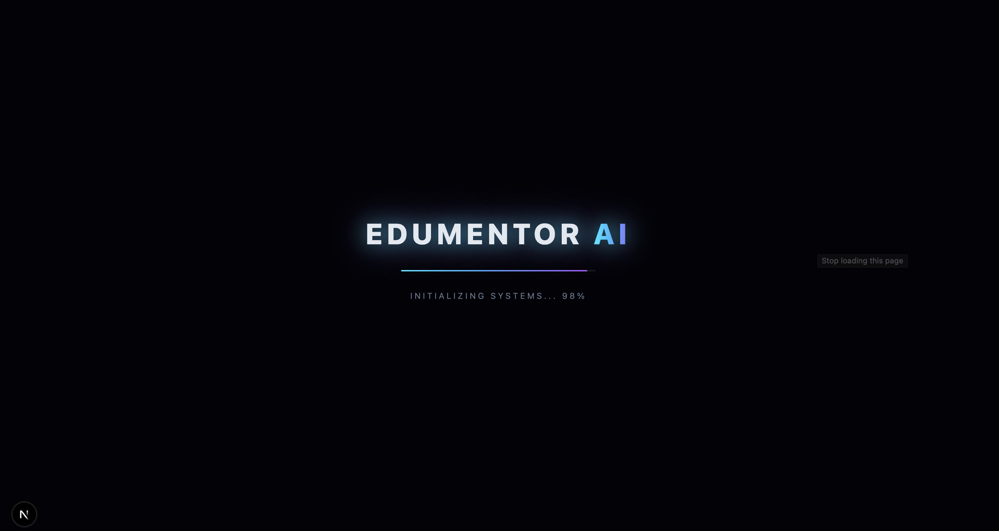
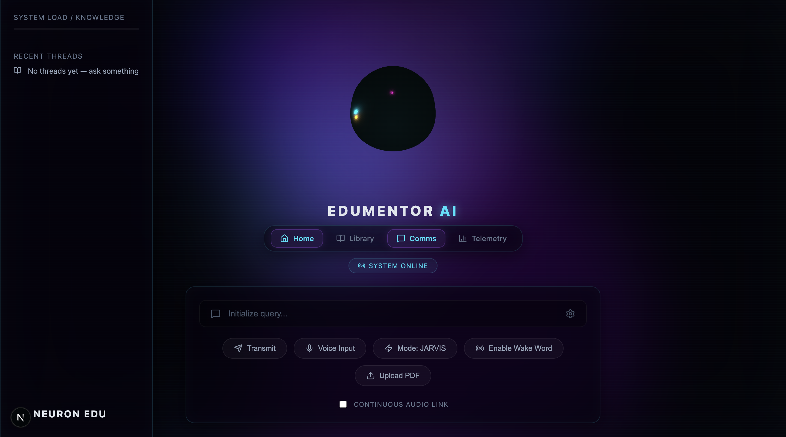

## 🔗 Live Demo
Frontend: https://edumentor-ai-54o3.vercel.app /n/n
Backend API docs: https://edumentor-backend-8fb8.onrender.com/docs


# EduMentor AI 🎓🤖

An AI-powered tutoring assistant with a JARVIS-inspired voice interface, a live 2050-style holographic UI, retrieval-augmented answers grounded in your own course material, and the ability to grow its own knowledge base from user-uploaded PDFs.

Built as a full-stack capstone project: FastAPI + LangChain + FAISS + Google Gemini on the backend, Next.js + Three.js on the frontend.

---

## ✨ Features

- **Voice-first interaction** — speak your question, hear JARVIS answer back, with a real Stop button and hands-free "conversation mode"
- **Wake word** — say "Hey JARVIS" to activate hands-free, no clicking required
- **RAG-grounded answers** — retrieves from your indexed PDFs via FAISS, cites source + page number, and honestly says when it doesn't know
- **JARVIS persona with memory** — remembers recent conversation, does casual small talk, switches between JARVIS / Academic / Empathetic tone
- **Live knowledge base growth** — upload a new PDF at any time; it's chunked, embedded, and immediately queryable, with real-time indexing progress
- **3D holographic UI** — animated Three.js background, a reactive AI orb/face that changes state (idle/listening/speaking/thinking), glass-panel HUD design, mouse-tilt hover effects, scan-line overlay
- **Activity dashboard** — real conversation stats, intent distribution chart, recent question log, all pulled from a real SQLite-backed history
- **Recent Threads sidebar** — click any past question to instantly re-ask it

---

## 🏗️ Architecture

```
┌─────────────────────┐         ┌──────────────────────────┐
│   Frontend (Next.js) │  HTTP   │   Backend (FastAPI)       │
│   - Holographic UI    │──────▶ │   - RAG pipeline (LangChain) │
│   - Web Speech API    │◀────── │   - FAISS vector store    │
│   - Three.js visuals  │  JSON  │   - Gemini (LLM + embeds) │
└─────────────────────┘         │   - SQLite (conversation memory) │
                                  └──────────────────────────┘
        Vercel (deploy)                 Render (deploy)
```

**Backend flow for a question:**
1. Classify intent (academic / small talk / identity)
2. If academic → similarity search in FAISS → build context from top-k chunks → prompt Gemini with persona + context → return grounded answer + sources
3. If small talk/identity → skip retrieval, answer in character directly
4. Save the exchange to SQLite for memory + dashboard stats

**Backend flow for a PDF upload:**
1. Save the file, kick off a background thread (so the request returns instantly)
2. Load + chunk the PDF, embed in batches (rate-limited for the free Gemini tier), add to the existing FAISS index
3. Frontend polls a job-status endpoint for live progress until indexing completes

---

## 🛠️ Tech Stack

**Backend:** Python, FastAPI, LangChain, FAISS, Google Gemini (`gemini-embedding-001`, `gemini-3.1-flash-lite`), SQLite

**Frontend:** Next.js, TypeScript, Three.js, Web Speech API (SpeechRecognition + SpeechSynthesis), Recharts, react-markdown

**Hosting:** Render (backend, free tier), Vercel (frontend, free tier)

---

## 🚀 Running Locally

### Backend

```bash
cd backend
python -m venv .venv
source .venv/bin/activate  # Windows: .venv\Scripts\activate
pip install -r requirements.txt
```

Create a `.env` file in `backend/`:
```
GOOGLE_API_KEY=your_gemini_api_key_here
```

Add your source PDFs to `backend/data/`, then build the initial index:
```bash
python ingest.py
```

Run the server:
```bash
uvicorn main:app --reload
```
Visit `http://127.0.0.1:8000/docs` to confirm it's running.

### Frontend

```bash
cd frontend
npm install
```

Create `frontend/.env.local`:
```
NEXT_PUBLIC_API_URL=http://127.0.0.1:8000
```

```bash
npm run dev
```
Visit `http://localhost:3000`.

---

## 🌐 Live Deployment

- **Backend:** deployed on [Render](https://render.com) (free tier — note: spins down after inactivity, first request after idle may take 30-60s to wake up)
- **Frontend:** deployed on [Vercel](https://vercel.com)

To deploy your own copy:
1. Push `backend/` and `frontend/` as separate GitHub repos (or keep this monorepo structure)
2. On Render: New → Web Service → connect the backend repo → set `GOOGLE_API_KEY` as an environment variable
3. On Vercel: Add New Project → connect the frontend repo → set `NEXT_PUBLIC_API_URL` to your Render URL

---
## System Interface

**Initialization Sequence**


**Main Dashboard & Comms**

## ⚠️ Known Limitations

- Render's free tier has an **ephemeral filesystem** — uploaded PDFs and the growing FAISS index reset on redeploy or extended inactivity. Fine for live demos; a persistent vector DB (Pinecone, Supabase pgvector) would be the fix for true permanence.
- Web Speech API voice input works reliably on Chrome/Edge desktop and Android Chrome; **not supported on iOS Safari**.
- Wake word detection is an approximation using continuous `SpeechRecognition` polling for the phrase — not true always-on hardware wake-word detection.

---

## 📁 Project Structure

```
edumentor-ai/
├── backend/
│   ├── main.py           # FastAPI app, all API endpoints
│   ├── query.py          # RAG pipeline, persona, intent classification
│   ├── ingest.py         # PDF loading, chunking, embedding, indexing
│   ├── memory.py         # SQLite conversation history
│   ├── quiz.py           # Quiz generation
│   ├── data/              # Source PDFs
│   └── faiss_index/       # Vector store (generated)
└── frontend/
    ├── app/
    │   └── page.tsx       # Main UI
    ├── components/
    │   ├── AIFace.tsx           # 3D reactive AI orb
    │   ├── AnimatedBackground.tsx
    │   └── IntroScreen.tsx
    └── hooks/
        ├── useVoice.ts     # Speech recognition + synthesis
        └── useTypewriter.ts
```

---

## 👤 Author

Built by **Abhishek Tiwari** as a capstone project.

## 📄 License

MIT
